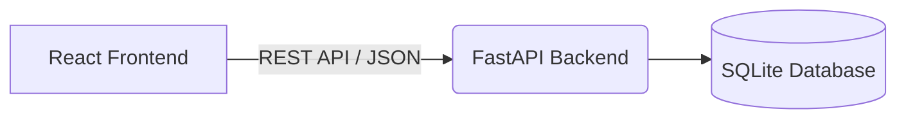

# Montrix 💸

 <!-- Optional: Add a screenshot placeholder -->

A premium, full-stack personal expense tracking application built with **React (Vite)** and **FastAPI**. Designed with a focus on minimalism, speed, and beautiful glassmorphism UI.

## ✨ Features

- **Dashboard & Analytics:** Visual breakdown of expenses using `recharts`.
- **CRUD Operations:** Easily create, read, update, and delete transactions.
- **Smart Filtering & Search:** Instantly filter expenses by category or search by description without full-page reloads.
- **Categorization:** 10 preset categories with custom color-coded badges (Food, Transport, Entertainment, Shopping, Bills, etc.).
- **Responsive Design:** A custom-built CSS design system that adapts perfectly to desktop, tablet, and mobile (featuring a custom mobile tab bar and floating action button).
- **FastAPI Backend:** High-performance, fully typed Python backend using Pydantic for strict data validation.
- **Lazy Loading:** Frontend routes are code-split using `React.lazy` and `Suspense` for blazing fast initial loads.

## 🛠️ Tech Stack

| Layer | Technology |
|-------|-----------|
| **Frontend** | React 18, Vite, React Router, Recharts, Lucide Icons |
| **Backend** | Python 3.11+, FastAPI, Uvicorn, Pydantic |
| **Database** | SQLite (Production-ready via SQLAlchemy - *PostgreSQL optional*) |
| **Styling** | Vanilla CSS with custom Design Tokens (No external UI libraries) |

## 🏗️ Architecture



## 🚀 Getting Started (Local Development)

### Prerequisites

- Node.js 18+
- Python 3.11+
- Git

### 1. Clone the repository

```bash
git clone https://github.com/yourusername/montrix.git
cd montrix
```

### 2. Backend Setup

```bash
cd backend
python -m venv venv

# Windows
venv\Scripts\activate
# Mac/Linux
source venv/bin/activate

pip install -r requirements.txt

# Start the server (runs on http://localhost:8000)
uvicorn app.main:app --reload
```

*Note: The API documentation is automatically available at `http://localhost:8000/docs` via Swagger UI.*

### 3. Frontend Setup

```bash
cd ../frontend
npm install

# Start the development server (runs on http://localhost:5173)
npm run dev
```

## 🚢 Production Deployment

Montrix is fully configured for production deployment.

### Environment Variables

Before deploying, ensure you set the correct environment variables.

**Frontend (`frontend/.env`):**
```env
VITE_API_URL=https://api.yourdomain.com/api/expenses
```

**Backend (`backend/.env`):**
```env
CORS_ORIGINS=https://yourfrontenddomain.com
DATABASE_URL=sqlite:///./montrix.db
```

### Building the Frontend

```bash
cd frontend
npm run build
```
The output will be generated in the `dist` folder, ready to be hosted on Vercel, Netlify, or Nginx.

### Running the Backend in Production

Use Gunicorn with Uvicorn workers for production readiness:
```bash
pip install gunicorn
gunicorn app.main:app -w 4 -k uvicorn.workers.UvicornWorker -b 0.0.0.0:8000
```

## 📄 License

This project is licensed under the MIT License.
